# TrillRApp 
The TrillR App was developed to work with the TrillR R package available here: <https://github.com/deanrobertevans/TrillR>. This application works as a user interface to select recordings for interpratation with the ability to view spectrograms and listen to recordings.

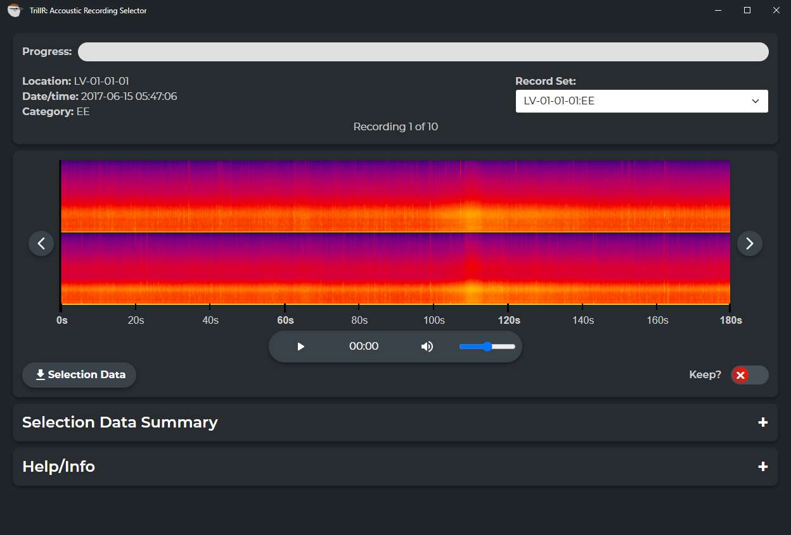 

## App Layout
The main Application Layout consists of four panels that contain the information and tools needed for recording selection. 
  -   The first panel will track your overall progress, indicate the location, date/time, and category of the recording, allow you to switch between record sets with the drop down, and show you the number of recordings available to select from for that record set. 
  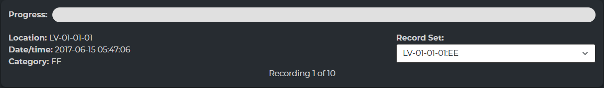  
> **Record Set:** A record set is defined as a location and category combination. One recording per record set is selected.
   -   The second panal will have your spectrogram for the recording you are looking at, audio controls, download button, and a keep toggle. 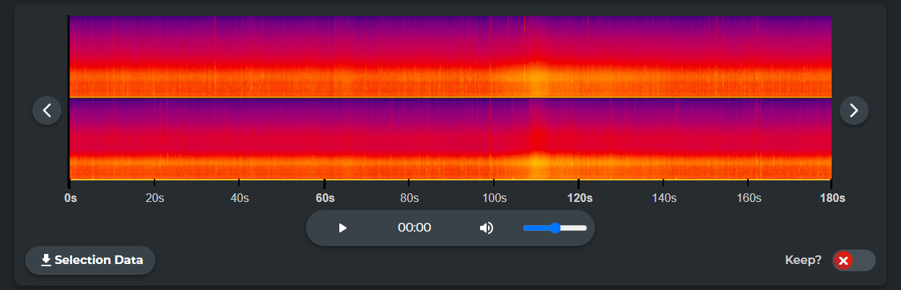
   -   The third panal is collapsable and contains tables for summarizing recording selection. You can see how many recordings have been selected per location and whether the selection is complete. You can further expand this table by clicking the location to see another table summarizing recordings by category. 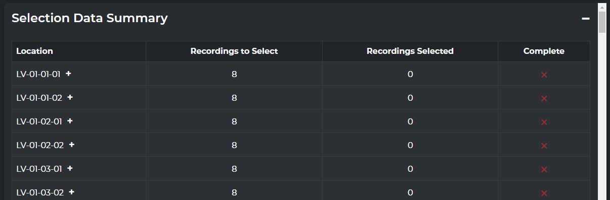
   -   Lastly, the fouth panal contains instructions on using the app as well as a list of keyboard shortcuts that are useful. 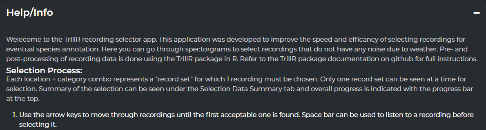

## Using the App
To use the TrillR App you need to go through the recording selection process as described in the TrillR R package to generate spectrograms and the corresponding recordingselection.csv file. This file provides important recording metadata for using the App. You will get an error message if important columns are missing from your upload file.

The selection process within the TrillR App is as follows:

1. Open the TrillR app and you will be prompted to upload your recordingselection.csv file by either dragging the file into the App or by browsing for it using the browse button.
 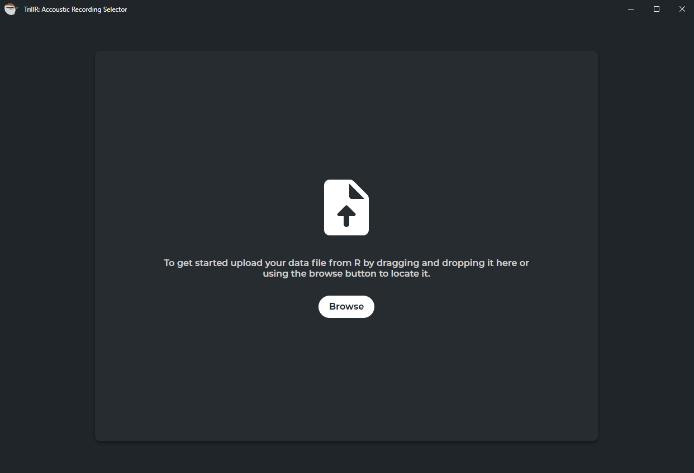

2. After you have successfully uploaded your data you will be presented with your first record set. If the first recording is suitable for interpretation you can select it by using the Keep toggle or by pressing the enter key. 

3. If the first recording is not suitable for interpretation you can navigate to the next possible recording using the right arrow key. Do so until you find the first suitable recording and select it by using the Keep toggle or by pressing the enter key. 

4. If no suitable recordings are available for a given record set you can manually go to the next record set by pressing the down arrow. To make up for this issue you can manually add an additional recording to an already selected record set by navigating to that record set and toggleing keep on a second recording. Only do this if it makes sense and you want to keep the number of recordings per location consistent. 

5. Continue until you have selected all possible recordings. 

6. When you are happy with your selection download your selected recordings data by using the download button. Which will let you save a selectedrecordings.csv file. This file is then brought back into R for final processing and clipping of files if needed.

## Best Practices for Selecting Recordings
Selecting Recordings for interpretation can be a little bit of an art form. Here are some general best practices to get you started but if you are ever unsure give the recording a quick listen. 
### What to look for in suitable recordings:
#### Good Recordings
A good recording is one that clearly shows animal vocalizations with little to no additional noise. The example below is an ideal situation and might not always be achievable. 
 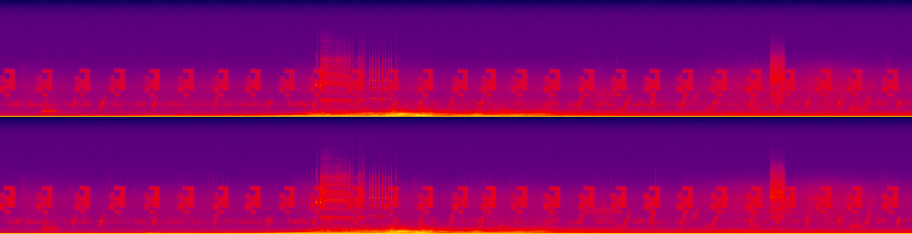
Sometimes noise but me inherent due to electrical interference, degrading microphones, or perhaps a running stream nearby. You will get a good idea if this is the case if all recordings have similar noise within them. Take the two recordings below as an example. Both of these recordings were taken at the same location days apart. You will notice they both look a lot noisier than the above image. This location unfortunately has some inherent noise that can not be remedied by selecting a different recording. As long as an interpreter can distinguish species in the recording these are acceptable. Make sure to listen to the recording to help make your decision!

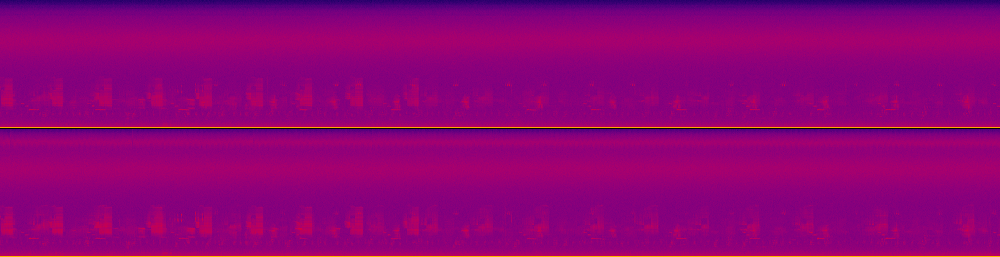
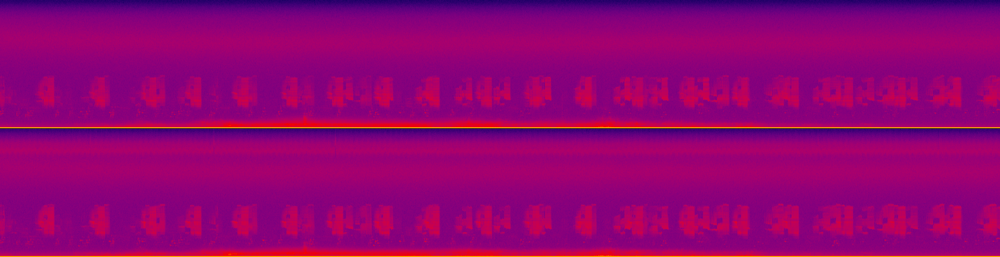

#### Bad Recordings
Bad weather will be the number one reason for a recording to not be suitable for interpretation. More often than not it will be easy to determine recordings during weather events. Another thing that can cause recordings to not be suitable is microphone failure this is usually indicated by only one of the two channels looking noisy. 

Below is an example of a weather event taking place and you can see that there are no distinct animal vocalizations. You may notice the vertical banding throughout the recording and this is indicative of rain.

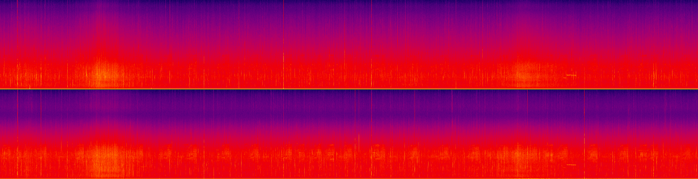

Wind can also make a recording unsuitable for interpretation. Wind might not always be consistent like rain but large gusts of wind can interfere with the microphone making animal vocalizations unrecognizable. Look out for large bouts of noise that span the majority of the height of a spectrogram.

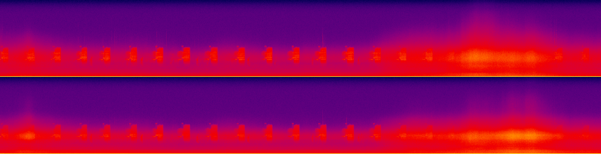